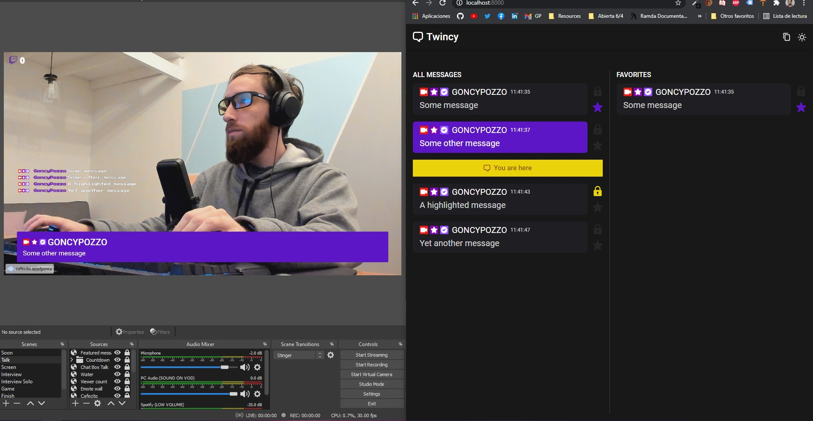

# Twincy
See all chat messages and click one to feature it on the stream.

## Use instructions
* Download the latest version from [releases](https://github.com/goncy/twincy/releases)
* Install the application using the installer
* Open the application
* Type the name of the channel you want to listen messages from
* Use the copy button from the navbar to copy the client app url.
* Add the client app url as a browser source on OBS.
* Send a message on the chat.
* Click the message on the admin.
* Now you should see that message on the stream.

## Actions
* Click: Toggle a message from screen
* Ctrl + Click: Send / remove a message from queue
* Alt + Click: Toggle bookmark

## Commands
* !q <question> // Automatically highlights the message
> Tagging the user also highlights the message

## Development instructions
* Run `npm start` on the console while being in this directory

## Standalone app
The standalone app is not yet distributed, but if you want to build it, go inside the `electron` folder and run `npm run make`, it will generate an `out` directory with the `.exe` inside.

---
Follow me on [Twitter](https://twitter.gonzalopozzo.com), on [Twitch](https://twitch.gonzalopozzo.com) and doname un [Cafecito](https://cafecito.gonzalopozzo.com) ✨
